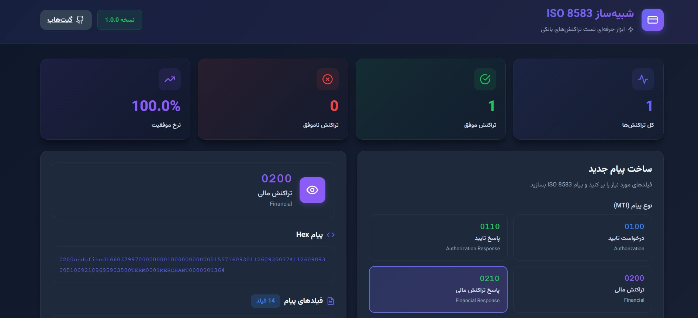
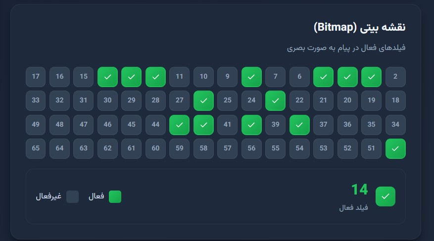

# 🏦 شبیه‌ساز ISO 8583

<div align="center">


**ابزار حرفه‌ای و کامل برای ساخت، تست و تحلیل پیام‌های ISO 8583**

یک شبیه‌ساز وب مدرن با رابط کاربری زیبا به زبان فارسی برای کار با استاندارد ISO 8583

[Demo](#) • [مستندات](#features) • [نصب](#installation) • [مشارکت](#contributing)

</div>

---

## ✨ ویژگی‌ها

### 🎯 قابلیت‌های اصلی

- ✅ **ساخت پیام**: ساخت آسان پیام‌های ISO 8583 با رابط کاربری ساده
- ✅ **پارس پیام**: تحلیل و نمایش کامل پیام‌های دریافتی
- ✅ **نمایش بصری Bitmap**: نمایش گرافیکی فیلدهای فعال
- ✅ **پشتیبانی کامل MTI**: تمام انواع پیام (0100, 0200, 0400, 0800, ...)
- ✅ **اعتبارسنجی**: بررسی خودکار صحت فیلدها
- ✅ **تولید داده تستی**: ساخت سریع داده‌های نمونه
- ✅ **آمار و تحلیل**: Dashboard آماری زنده
- ✅ **فونت زیبای فارسی**: با استفاده از فونت Vazirmatn

### 🎨 طراحی

- 🌙 **Dark Mode**: طراحی مدرن با تم تیره
- 📱 **Responsive**: کاملا واکنش‌گرا برای موبایل و تبلت
- 🎭 **انیمیشن‌های نرم**: تجربه کاربری روان
- 🎯 **UX بهینه**: طراحی شده برای استفاده آسان

### 🔧 قابلیت‌های تکنیکال

- ⚡ **سریع**: ساخته شده با Vite و React 18
- 🔒 **امن**: Masking اطلاعات حساس (PAN, PIN)
- 📋 **Copy to Clipboard**: کپی آسان پیام‌ها
- 🔄 **Real-time**: نمایش لحظه‌ای تغییرات
- 💾 **تاریخچه**: ذخیره تراکنش‌ها

---

## 📸 تصاویر

<div align="center">

### صفحه اصلی


### نمایش Bitmap


</div>

---

## 🚀 نصب و اجرا

### پیش‌نیازها

```bash
Node.js >= 18.0.0
npm >= 9.0.0
```

### نصب

```bash
# کلون کردن پروژه
git clone https://github.com/milad-fa/iso8583-simulator.git

# ورود به پوشه
cd iso8583-simulator

# نصب وابستگی‌ها
npm install

# اجرای برنامه
npm run dev
```

برنامه روی `http://localhost:3000` در دسترس خواهد بود.

---

## 📖 استفاده

### 1. ساخت پیام جدید

```javascript
// انتخاب MTI
const mti = '0200'; // Financial Transaction

// پر کردن فیلدها
const fields = {
  2: '6037997000000001',  // شماره کارت
  3: '000000',            // کد پردازش
  4: '000000050000',      // مبلغ (50,000 ریال)
  // ... فیلدهای دیگر
};

// ساخت پیام
const message = buildMessage(mti, fields);
```

### 2. پارس کردن پیام

```javascript
// پیام Hex
const hex = '0200B220000000000000...';

// پارس
const message = parseMessageFromHex(hex);
console.log(message.fields);
```

### 3. اعتبارسنجی

```javascript
// بررسی شماره کارت
const isValid = validateCardNumber('6037997000000001');

// اعتبارسنجی فیلد
const validation = validateField(4, '000000050000');
if (validation.valid) {
  console.log('فیلد معتبر است');
}
```

---

## 🏗️ ساختار پروژه

```
iso8583-simulator/
├── src/
│   ├── components/         # کامپوننت‌های React
│   │   ├── Header.jsx
│   │   ├── MessageBuilder.jsx
│   │   ├── MessageViewer.jsx
│   │   ├── BitmapVisualizer.jsx
│   │   └── Statistics.jsx
│   ├── data/              # داده‌های استاتیک
│   │   └── fields.js      # تعریف فیلدها و MTI
│   ├── utils/             # توابع کمکی
│   │   └── iso8583.js     # توابع ISO 8583
│   ├── App.jsx            # کامپوننت اصلی
│   ├── main.jsx           # Entry point
│   └── index.css          # استایل‌ها
├── package.json
├── vite.config.js
└── README.md
```

---

## 🔬 تکنولوژی‌های استفاده شده

| تکنولوژی | نسخه | کاربرد |
|---------|------|--------|
| React | 18.2 | فریمورک UI |
| Vite | 5.0 | Build Tool |
| Lucide React | 0.263 | آیکون‌ها |
| Vazirmatn | 33.003 | فونت فارسی |

---

## 📋 فیلدهای پشتیبانی شده

### فیلدهای اصلی

- **Field 0**: MTI (Message Type Indicator)
- **Field 2**: PAN (Primary Account Number)
- **Field 3**: Processing Code
- **Field 4**: Transaction Amount
- **Field 7**: Transmission Date & Time
- **Field 11**: STAN (System Trace Audit Number)
- **Field 37**: Retrieval Reference Number
- **Field 39**: Response Code
- **Field 41**: Terminal ID
- **Field 42**: Merchant ID
- و 60+ فیلد دیگر...

---

## 🎓 مستندات ISO 8583

### انواع پیام (MTI)

| MTI | نام فارسی | توضیحات |
|-----|----------|---------|
| 0100 | درخواست تایید | Authorization Request |
| 0200 | تراکنش مالی | Financial Transaction |
| 0400 | برگشت تراکنش | Reversal |
| 0800 | پیام شبکه | Network Management |

### کدهای پاسخ متداول

| کد | معنی فارسی | Response Code |
|----|-----------|--------------|
| 00 | تایید شد | Approved |
| 51 | موجودی ناکافی | Insufficient Funds |
| 55 | رمز اشتباه | Incorrect PIN |
| 91 | سیستم در دسترس نیست | System Unavailable |

---

## 🛠️ توسعه

### اضافه کردن فیلد جدید

```javascript
// در src/data/fields.js
export const ISO_FIELDS = {
  // ... فیلدهای موجود
  999: {
    name: 'فیلد جدید',
    type: 'ans',
    length: 20,
    format: 'llvar',
    description: 'توضیحات فیلد',
    example: 'مثال',
    required: false,
  }
};
```

### اضافه کردن MTI جدید

```javascript
// در src/data/fields.js
export const MTI_TYPES = {
  // ... انواع موجود
  '0300': {
    name: 'نام فارسی',
    category: 'دسته‌بندی',
    color: '#FF5733'
  }
};
```

---

## 🤝 مشارکت

مشارکت شما در بهبود این پروژه خوش‌آمد است!

### مراحل مشارکت

1. Fork کردن پروژه
2. ساخت Branch جدید (`git checkout -b feature/AmazingFeature`)
3. Commit کردن تغییرات (`git commit -m 'Add some AmazingFeature'`)
4. Push کردن به Branch (`git push origin feature/AmazingFeature`)
5. باز کردن Pull Request

---

## 📝 TODO

- [ ] پشتیبانی از EMV/Chip data (Field 55)
- [ ] محاسبه MAC و PIN Block
- [ ] Export/Import پیام‌ها (JSON, XML)
- [ ] حالت Server/Client TCP/IP
- [ ] Test Case Management
- [ ] Load Testing
- [ ] Multi-language support
- [ ] موبایل اپلیکیشن

---

## 📄 لایسنس

این پروژه تحت لایسنس MIT منتشر شده است - فایل [LICENSE](LICENSE) را برای جزئیات بیشتر ببینید.

---

## 👨‍💻 نویسنده

**میر میلاد فارسی**

- Github: [Milad-fa](https://github.com/milad-fa)
- LinkedIn: [Mir Milad](https://linkedin.com/in/mir-milad-farsi-6b12a91ab)
- Telegram: [Milad_developer](https://t.me/milad_developer)

---

## 🙏 قدردانی

- [jPOS](https://jpos.org/) - الهام‌بخش
- [React](https://react.dev/) - فریمورک عالی
- [Vazirmatn Font](https://github.com/rastikerdar/vazirmatn) - فونت زیبا
- جامعه توسعه‌دهندگان ایرانی ❤️

---

## 📞 پشتیبانی

اگر سوالی دارید یا به مشکل خوردید:

1. یک [Issue](https://github.com/milad-fa/iso8583-simulator/issues) باز کنید
2. به [Discussions](https://github.com/milad-fa/iso8583-simulator/discussions) بپیوندید


---

<div align="center">

**اگر این پروژه برایتان مفید بود، یک ⭐ بدهید!**

ساخته شده با ❤️ برای جامعه توسعه‌دهندگان

</div>
